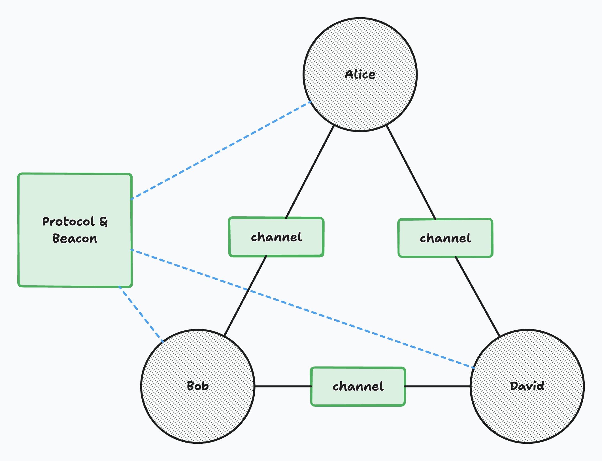

# No-Exit Room Without Cooperation

A non-cryptography MPC puzzle.

## Description

Alice, Bob, and David are each locked in separate rooms. In each room, they have a unique private input and polynomial. If their private input is leaked, the room will be permanently locked.

They can communicate with each other via channels, but every message transmitted through these channels is monitored.

To escape, they must collaboratively calculate the sum of their private inputs without revealing them. Only by doing so can they unlock the doors and gain their freedom.

## Smart Contract Diagram



## NOTE

The infra shouldn't be vulnerable.
It's not necessary to look at anywhere other than the solidity files `src/contracts` to solve this challenge!

Start the local challenge server:
```
docker compose up --build
```
